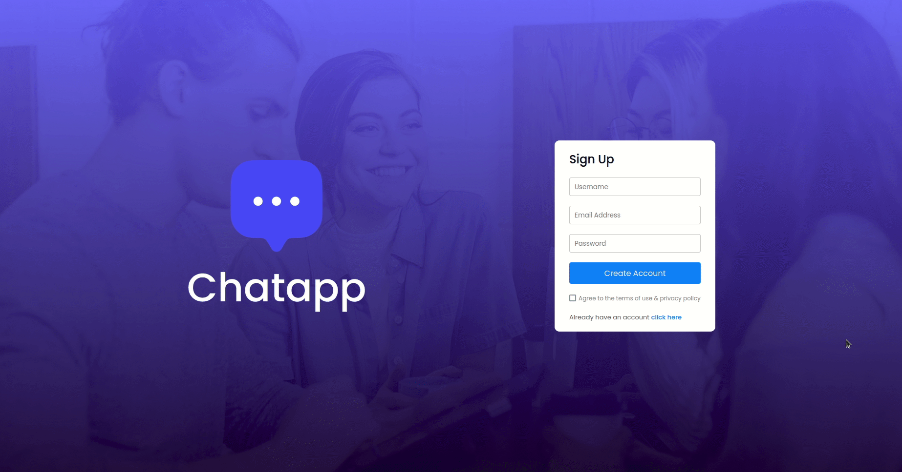
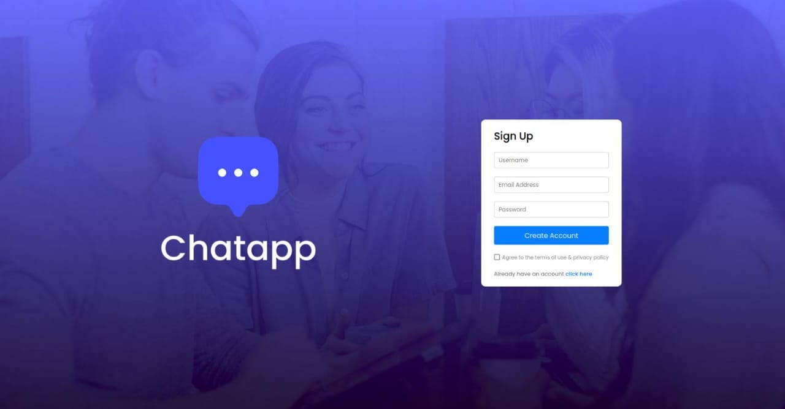
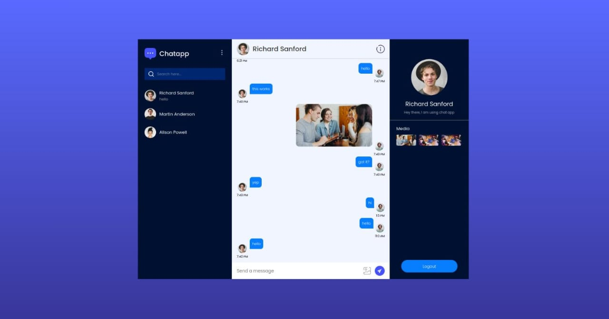
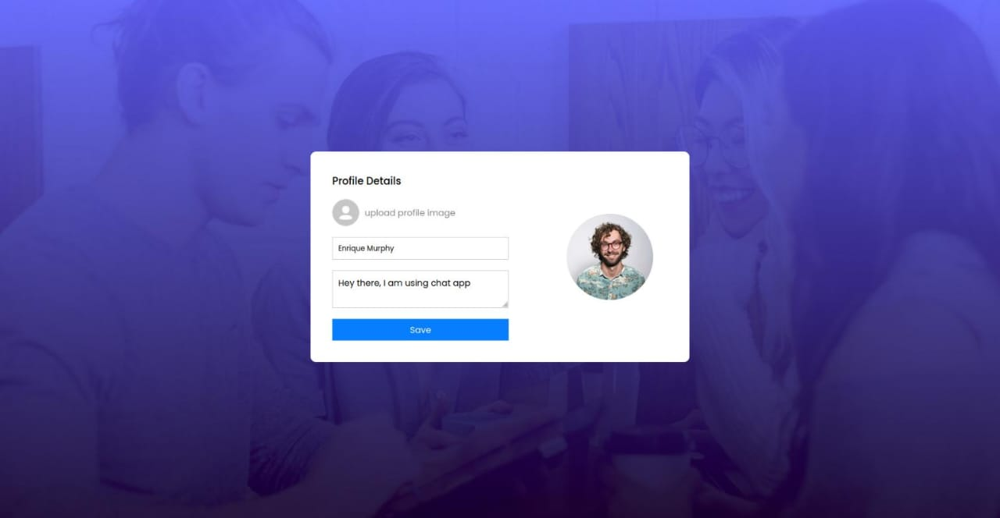

# Full Stack Chat Application with React & Firebase

## Overview

This project is a **full-stack chat application** built using **React.js** for the frontend and **Firebase** for backend services, including authentication, real-time messaging, and storage. The application allows users to **sign up, log in, and chat in real-time** with other users. Additional features include:

- **User authentication** (Sign in/Sign up with email & password)
- **Personal chats** with real-time messaging
- **Media sharing** (images, videos, and files)
- **Profile customization** (update display name and profile picture)
- **Secure database integration with Firebase Firestore**

## Demo

### Real-time Messaging Demo


### User Interface

Sign Up/Sign In Page


Chatbox Page


Update Personal Data Page


## Installation

### Prerequisites
- Node.js (v16+ recommended)
- Firebase account & project setup

### Setup
```bash
# Clone the repository
git clone https://github.com/yourusername/Chat_Application.git
cd Chat_Application
```

## Firebase Configuration
```js
const firebaseConfig = {
  apiKey: "your_api_key",
  authDomain: "your_auth_domain",
  projectId: "your_project_id",
  storageBucket: "your_storage_bucket",
  messagingSenderId: "your_messaging_sender_id",
  appId: "your_app_id"
};
```

### Running Locally
```bash
npm run dev
```